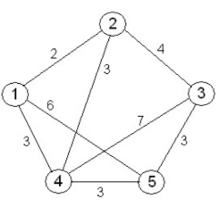
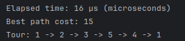
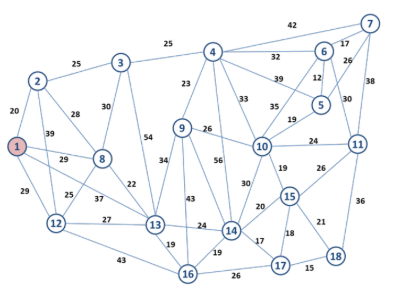

## TSP 
The travelling salesman problem is a NP-Complete problem. It consists in a problem with no faster optimal solution.
However, there are approximate algorithms to find a satisfactory result.
We will implement some cases to solve a tsp with 5 and 18 cities.
The first one will be te **Brute-force**.

### Brute Force

### 5 cities to visit
**5! = 120 permutations**

And for the second case with 18!=6.402.373.705.728.000
